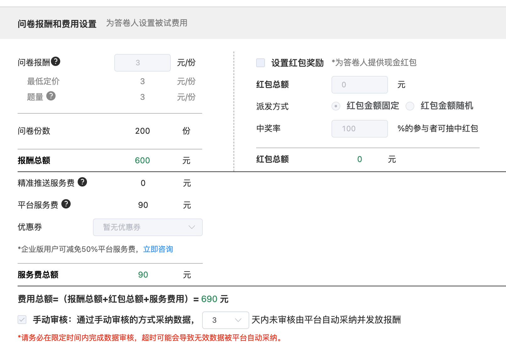

### 数据来源说明

- 本篇报告的受访对象来自[credamo(见数)](https://www.credamo.com/)

  - [问卷填写地址](https://www.credamo.com/s/QVri2iano)
  - 问卷二维码

  ```{r echo=FALSE, out.width='42%', fig.align="center", fig.retina = 2}
  knitr::include_graphics("images/datasource-qrcodes.png")
  ```

- 本项目样本量虽然不大，但全部通过付费采集并人工校验筛选，数据可信度较高（填写时间普遍在10分钟以上）。在此特别感谢北京大学国发院[马京晶
](http://scholar.pku.edu.cn/jjma/node/11067)教授在战略管理学课程中为我们的学术作业出资。

  - 问卷后台系统截图：

```{r echo=FALSE, out.width='65%', fig.align="center", fig.retina = 2}

```


---

### 问卷原始数据

- 后续会代码进行清洗，详见分析报告的第一部分

```{r include=FALSE}
options(warn = -1)

library(knitr)
knitr::opts_chunk$set(message = FALSE,
                      cache=TRUE)
source("FUNCS.R")
source("FUNCS_plotly.R")
source("FUNCS_ggplot2.R")
```

```{r echo=FALSE}
 read_excel("data/2021_04_29_02_11_56.xlsx") %>% 
  slice(2:n()) %>%
  select(-21) %>%

  # 标记NA 
  dplyr::mutate_all(~ifelse(is.na(.x), "-",.x)) %>%
  get_DT()
```

---

### 问卷样式

```{r out.height = "1500px", out.width='1240px', fig.align="center", echo=F}
knitr::include_graphics("data/questionnair.pdf",
                        dpi = 300)
```